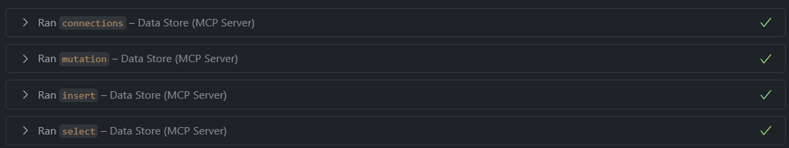
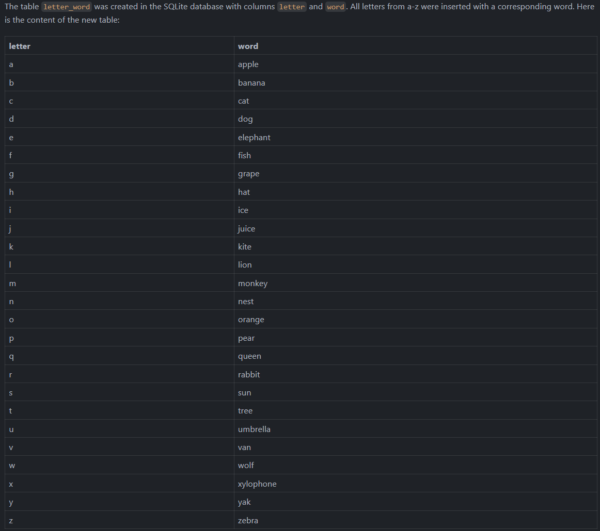
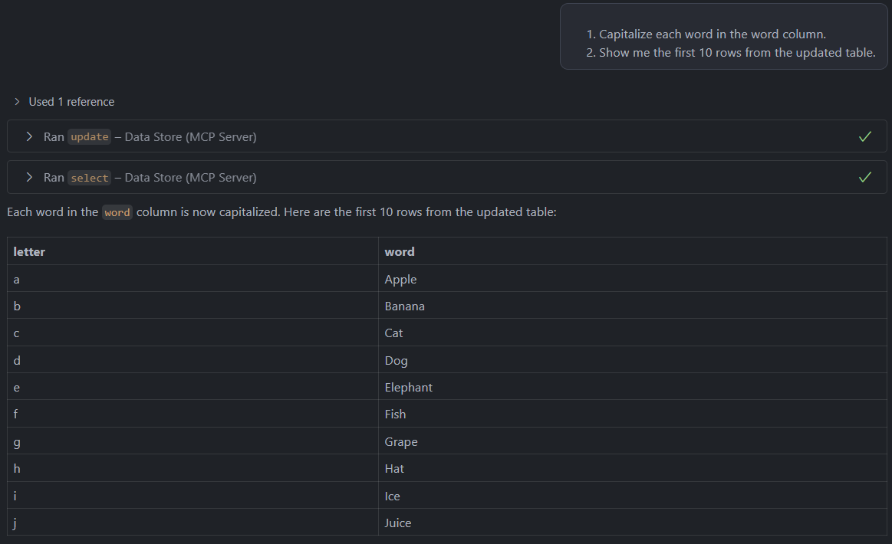

# Data Store MCP

The Data Store MCP (Model Context Protocol) is an extension for Visual Studio Code that provides a seamless integration with various data storage solutions. It allows developers to interact with databases and other data sources directly from their code editor, streamlining the development process and improving productivity.

## Benefits

With the Data Store MCP, you can leverage the benefits of AI to manage, query, and manipulate your data across multiple data stores. Some of the benefits include:

- Leveraging the power of AI to assist with getting and managing your data across multiple data stores.
- Generate reports and summaries of your data.
- Getting information about your data store structure, schema, tables and much more.
- Using AI to generate complex `SQL`/`GraphQL` queries that you may not know how to write.
- Easily managing connections to multiple data stores through a simple `JSON` configuration.
- Executing data operations directly from your code editor without switching contexts.
- Testing API endpoints and validating responses.
- Getting data from one data store and using it in another.
  - Getting the schema from a `MySQL` database and using it to generate a `GraphQL` query or a `Rust` operation.
  - Querying a `PostgreSQL` database and copying the data to a `MySQL` database.
- Using built-in tools to search the internet for information, then compiling that information into a structured format to store in your data store.
- Using the agent to perform complex data operations that would otherwise require writing custom code.
- Save content from the server locally to a file.

# Table of Contents

- [Data Store MCP](#data-store-mcp)
  - [Benefits](#benefits)
- [Table of Contents](#table-of-contents)
  - [⚠️ Safety Warning ⚠️](#️-safety-warning-️)
  - [The agent](#the-agent)
    - [Comments/Descriptions](#commentsdescriptions)
    - [Forcing a tool to run](#forcing-a-tool-to-run)
    - [Tool failure](#tool-failure)
  - [Example](#example)
  - [Setup a data store](#setup-a-data-store)
    - [.gitignore](#gitignore)
    - [Connection files](#connection-files)
      - [Placeholders](#placeholders)
      - [Descriptions](#descriptions)
      - [Same data different stores](#same-data-different-stores)
      - [A sample database connection](#a-sample-database-connection)
      - [A sample Rust connection](#a-sample-rust-connection)
    - [A sample GraphQL connection](#a-sample-graphql-connection)
  - [Available tools](#available-tools)
    - [`connections` (full support)](#connections-full-support)
    - [`payload` (full support)](#payload-full-support)
    - [`schema` (partial support)](#schema-partial-support)
    - [Executable commands](#executable-commands)
      - [`select` (full support)](#select-full-support)
      - [`mutation` (full support)](#mutation-full-support)
      - [`insert` (partial support)](#insert-partial-support)
      - [`update` (partial support)](#update-partial-support)
      - [`delete` (partial support)](#delete-partial-support)

### ⚠️ Safety Warning ⚠️

The tools try their best to avoid any actions that could harm the data store such as deleting important data or making irreversible changes by using specifically designed tools that analyze queries when possible and block them from running in the wrong context. However, this is not always possible.

Here are some ways for using the MCP safely outside of the tools:

- Use a test data store for development and testing.
- Use a data store user with limited permissions for the agent.
- Use version control to track changes to your data store.
- Regularly backup your data store.
- Have the agent read the `schema` then have it output the `INSERT`, `UPDATE`, and `DELETE` queries instead of executing them directly. This way you can review the queries before they are executed.
  - `read the #schema and show me an insert for an address`

## The agent

The agent is a powerful AI that can interact with the data store using the tools provided by the MCP. It can understand natural language instructions and execute the appropriate tools to perform the requested actions.

**Note:** When prompting the agent, sometimes it needs a little nudge in the right direction to use the tools, so it is recommended that you use `#connections` somewhere within the first prompt. This helps the agent know that you want to work with the Data Store tools and in most cases will start using the proper tools without being prompted to do so thereafter.

### Comments/Descriptions

If you are using a data store that supports comments/descriptions for your tables/columns/collections/etc., the agent will use them to understand the context of the data so that it can generate more accurate queries.

```sql
create table users (
  id int(10) unsigned primary key not null auto_increment comment 'The unique identifier for the user',
  name varchar(255) not null comment 'The name of the user',
  email varchar(255) not null comment 'The email address of the user',
)
comment 'This table stores information about users in the system';
```

### Forcing a tool to run

Sometimes the agent doesn't run a tool even you give it instructions that clearly indicate that it should run a specific tool. So, you can force the agent to run a specific tool by using the `#tool` syntax in your instructions. For example, if you want to run the `select` tool, the agent will sometimes search your codebase for the `select` keyword and not run the tool. In this case, you can force it to run the tool by using the `#select` syntax.

```
#select 5 users from the users table
```

### Tool failure

When a tool fails, the agent will try to understand the error and if possible will try to run the tool again with modified parameters. It will repeat this process until it either succeeds or exhausts all attempts in which case it will return a message that may help you understand what went wrong and how to fix it.

**Note:** Just because a tool fails, doesn't mean that there is a bug in the tool or the MCP. It may just be due to incorrect input by the agent or insufficient permissions. The agent will attempt to fix the issue on its own, but if it is unable to do so, it will provide a helpful error message.

For example:

> I do not a have permission to update the `posts` table, you may need to enable the `update` tool to perform this action.

## Example

```md
In the sqlite database, do the following:

1. Create a table `letter_word` with two columns: `letter`, `word`.
2. Insert all letters from a-z and generate a word for it.
3. Show me the content of the new table.
```

The above will run the following tools:

1. First it will run the `connections` tool to get a list of connections.
2. Then it will run the `mutation` tool to create the table.
3. Next it will run the `insert` tool to populate the table.
4. Finally it will run the `select` tool to get the content of the table.



Next it will output the content of the table:



We can then run additional queries to modify the data.

```md
1. Capitalize each word in the word column.
2. Show me the first 10 rows from the updated table.
```

This will then do the following:

1. Run the `update` tool to capitalize each word in the `word` column.
2. Run the `select` tool to get the first 10 rows from the updated table.



## Setup a data store

To add connections to the data store, create one or more JSON files in the `.vscode` folder of your workspace. The following file names are supported:

- `connections.json` or `stores.json`: This file is used to define multiple connections in an array format.
- `*.connection.json` or `*.store.json`: These files are used to define a single connection or store (note that there is no (`s`) after `connection` or `store`).

### .gitignore

It is recommended to add these files to your `.gitignore` to avoid committing sensitive information.

```
.vscode/*connection*.json
.vscode/*store*.json
```

### Connection files

Depending on the file type, the file will contain either an array of connections or a single connection object. Each connection object will have three properties: `id`, `type`, and `options`.

| Property      | Type   | Required | Description                                                                                                    |
| ------------- | ------ | -------- | -------------------------------------------------------------------------------------------------------------- |
| `id`          | string | Yes      | A unique identifier for the connection.                                                                        |
| `type`        | string | Yes      | The type of the data store (e.g., `mysql`, `sqlite`).                                                          |
| `options`     | object | Yes      | Connection options specific to the data store type.                                                            |
| `description` | string | No       | A human-readable description of the connection. This helps the agent understand the purpose of the connection. |

- Databases
  - [MySQL Options](https://github.com/mysqljs/mysql?tab=readme-ov-file#connection-options)
  - [Postgres Options](https://node-postgres.com/apis/client)
  - [MSSQL Options](https://www.npmjs.com/package/mssql)
  - Sqlite Options
    - `filename: string`, which is the path to the SQLite database file
    - Optional `mode: number`, defaults to `sqlite.OPEN_READWRITE | sqlite.OPEN_CREATE`
- HTTP/REST API's
  - Rest (Create, Read, Update, Delete) operations can be defined with a `type` of `rest` and an `options` object that contains an array of endpoints.
    - Each endpoint can be a string URL or an object with a `url`.
    - Use a `description` field to provide context about the endpoint to the agent.
    - Use a `search` object to describe the search parameters for the endpoint `?key=value`.
    - Use a `method` field to specify the HTTP method (e.g., `GET`, `POST`, `PUT`, `DELETE`).
  - GraphQL
    - Use a `type` of `graphql` and an `options` object that contains the GraphQL endpoint URL.
    - Use a `query` field to provide the GraphQL query string.

#### Placeholders

The agent will usually replace placeholders in `urls` and anywhere it deems appropriate as long as it is clear to the agent. For example, using `{"url": "https://api.example.com/posts/:id"}` the agent will replace `:id` with the actual post ID when making a request.

You can use any type of placeholder that you would like as long as the agent can understand it. For example, you can use `:id`, `{id}`, or any other format that makes sense for your API.

#### Descriptions

Try to use the description field as much as possible to provide context about the connection, object, operation, etc. This helps the agent understand what the connection is used for and how to use it effectively. Without it, the agent has to do guesswork. This can lead to a higher chance of error.

#### Same data different stores

Sometimes you can have the same data but from different stores, for example you could have a connection to a MySQL database, and a REST API. In this case, you can get the `schema` from the MySQL database and use it to generate a REST `http` request to the API.

```md
Query the "mysql" database for the #schema and then #select the `posts` endpoint using "rest".
```

This will first use the `schema` tool to get the schema of the `posts` table from the MySQL database, and then use the `select` tool to query the `posts` endpoint using the REST API.

#### A sample database connection

A database connection has an `id`, a `type`, and an `options` object. The `options` object contains the connection details specific to the database type. The `description` field provides context about the database connection to the agent, helping it understand what the connection is used for.

```json
{
  "id": "my-mysql-connection",
  "type": "mysql",
  "description": "A connection that stores information about the blog on my website.",
  "options": {
    "host": "localhost",
    "user": "root",
    "password": "password",
    "database": "blog"
  }
}
```

#### A sample Rust connection

A Rust connection has a `url`, an optional `headers` object, and an `endpoints` array. Each endpoint can be a string URL or an object with a `url` and optional `description` and `method`. The `search` object can be used to describe the search parameters for the endpoint `?key=value`. The `headers` can be used to pass authentication tokens or other necessary headers for the API. The `description` field provides context about the Rust operation to the agent, helping it understand what the operation does and how to use it.

1. A `GET` request to retrieve all posts.
2. A `GET` request to retrieve a specific post by ID.
3. A `GET` request to search for posts by title or content.

```json
{
  "id": "my-rest",
  "type": "rest",
  "description": "A REST operation for managing blog posts.",
  "options": {
    "headers": {
      "Authorization": "Bearer YOUR_ACCESS_TOKEN"
    },
    "endpoints": [
      "https://api.example.com/posts",
      {
        "url": "https://api.example.com/posts/:id",
        "description": "Get a specific post by ID"
      },
      {
        "url": "https://api.example.com/search",
        "description": "Finds posts by title or content",
        "search": {
          "query": "The term to search for"
        }
      }
    ]
  }
}
```

### A sample GraphQL connection

A GraphQL connection has a `url`, and optional `headers`, and a `description` field. The `headers` can be used to pass authentication tokens or other necessary headers for the GraphQL API. The `description` field provides context about the GraphQL operation to the agent, helping it understand what the operation does and how to use it.

```json
{
  "id": "my-graphql",
  "type": "graphql",
  "description": "A GraphQL operation for managing blog posts.",
  "options": {
    "url": "https://api.example.com/v1/graphql",
    "description": "The GraphQL endpoint for the API.",
    "headers": {
      "Authorization": "Bearer YOUR_ACCESS_TOKEN"
    }
  }
}
```

## Available tools

These are tools that the MCP uses to interact with the data store. The tools are registered in the MCP server and can be used in the agent's instructions.

**Note:** Not all data sources support all tools due to how the store may work. For example, an API data source may not support getting tables if there is no concept of tables in the API. Or for GraphQL APIs, it may not be know if a mutation is an `INSERT`, `UPDATE`, or `DELETE` operation. In such cases, the agent may work unpredictably if it tries to use not fully supported tools.

### `connections` (full support)

This tool will get all the connections defined in the `connections.json`, `stores.json`, `*.connection.json`, or `*.store.json` files in the `.vscode` folder of your workspace.

**Note:** It is recommended to not disable this tool as it is used by the agent to get the list of connections. If you disable it, you will need to manually provide the connection ID in your instructions.

### `payload` (full support)

This tool will get the payload that is needed for the data source. The payload is a JSON object that contains the information needed to perform the operation on the data source, as it's structure will vary depending on the data source type and the operation being performed.

**Note:** It is recommended to not disable this tool as it is used by the agent to get the payload information for the data source. If you disable it, the agent may not be able to perform certain operations.

### `schema` (partial support)

This tool will get the full data store schema, unless a specific table is requested.

**Note:** This tool may not be supported by all data sources. For example, an API data source may not have a concept of tables or schemas.

### Executable commands

**Note:** For SQL database, queries are validated using the [node-sql-parser](https://www.npmjs.com/package/node-sql-parser) package, which may not cover all edge cases. It is recommended to setup your database user with limited permissions to prevent any accidental data modification if the agent attempts to execute a database mutation query.

#### `select` (full support)

This tool can only execute `SELECT` statements on the current database connection. This is useful for restricting the agent from executing potentially harmful queries.

**Note:** This may not catch all queries, so it is recommended to setup your database user with read-only permissions to prevent any accidental data modification if the agent attempts to execute a mutation query.

#### `mutation` (full support)

This tool can execute any type of query without restriction. This is useful for creating tables or other schema changes.

#### `insert` (partial support)

This tool can execute `INSERT` statements on the current database connection.

**Note:** For GraphQL queries, the tool doesn't know if a mutation is an `INSERT`, `UPDATE`, or `DELETE` operation.

#### `update` (partial support)

This tool can execute `UPDATE` statements on the current database connection.

**Note:** For GraphQL queries, the tool doesn't know if a mutation is an `INSERT`, `UPDATE`, or `DELETE` operation.

#### `delete` (partial support)

This tool can execute `DELETE` statements on the current database connection.

**Note:** For GraphQL queries, the tool doesn't know if a mutation is an `INSERT`, `UPDATE`, or `DELETE` operation.
